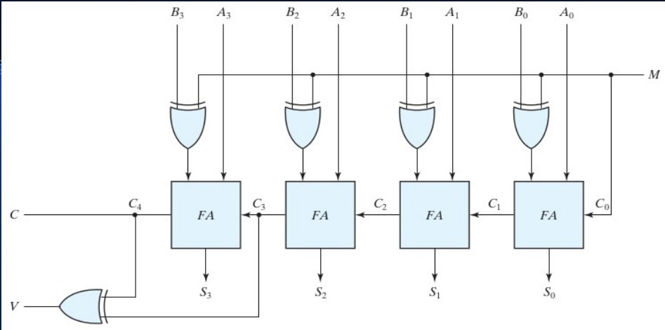

# 32bit_adder_substractor
pre synthesized adder/substructor module

Experimental 32 bit adder/subtractor module implementation on Verilog without using any arithmetic operator.  
The program demonstrates a kind of presynthesized module.

Here is referenced 4 bit adder/substractor circuit diagram:

Format: 
